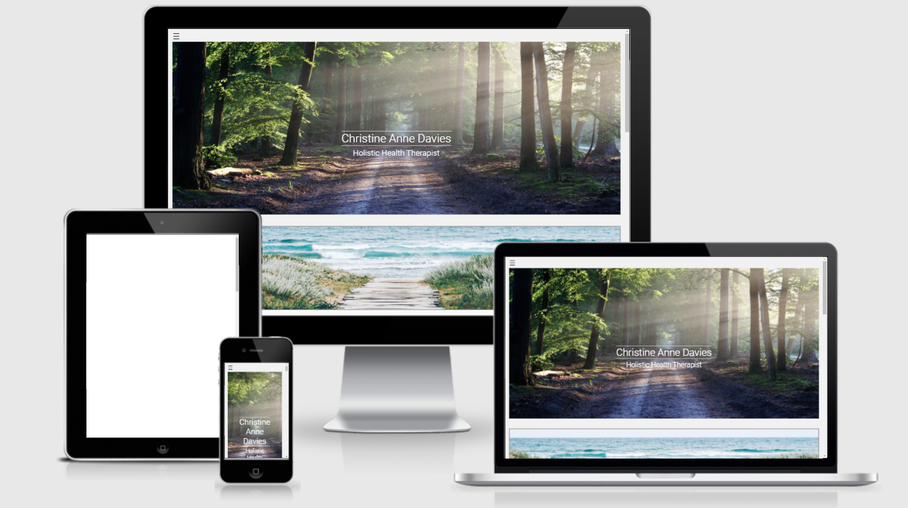

# Christine Anne Davies Website

[View live website here](https://edavies2020.github.io/MS2-CDavies/)

This website has been created to promote Christine Anne Davies Holistic Therapies business. 

Christine and I discussed her requirements for the website, she provided a brief document listing her requirements. 
We discussed this in more detail and I brainstormed my thoughts: [view brief/brainstorm](assets/images/readme/brief.pdf)

Cristine also sent over a document about her business with Michael Davies, 'Springboard'. 
She would like to include an introduction to this venture on her site: [view Springboard document](assets/images/readme/springboard.docx)

## Website Purpose
-------------------

* For users to find her business and see what therapies she offers
* Inform users of her background and philosophy behind her therapies
* Give details of therapies she offers including timings and prices
* Show users where she is based
* Inform users of her collaboration with Michael Davies and give a brief introduction to their business 'Springboard'
 
## Key Considerations
----------------------

* Professional, uncluttered and simple layout
* A feeling of calm throughout with usage of natural images
* A modern, clear font
* Text to be in black, grey or soft Technologies
* images not to be literal, but representative
* Springboard page to fit with rest of site but have its own identity
* Springboard page to use purple

* Note: At the time of creating this readme there no image is showing for ipad on [Am I responsive](http://ami.responsivedesign.is/).
    This appears to be an issue with their site [see screenshot of their homepage](assets/images/readme/amiresponsive2.PNG)
    To be sure, I tested this further using: [what is my screen resultion](http://whatismyscreenresolution.net/multi-screen-test), 
    with no issues. [see result](assets/images/readme/ipadtest.PNG)
 

## User Experience (UX)
----------------------

### First time user goals:

* Easily understand what the business offers and purpose of the website
* Easy to navigate
* Testimonials to show what the users think of Christine and her therapies
* Help users to get a feel for Christine as a person to decide if she is right person to treat them
* Details of therapies, prices and appointment details
* Provide contact details for Christine and location. Easy to make contact with Christine via the website and acknowledgement of the enquiry
* Give and introduction to Christine’s joint venture, Springboard

### Returning user goals:

* Find/double check contact Information, check location
* Find information on other treatments following initial appointment
* Showing friends/recommendation
* Springboard updates
* Christine would like a client area added to upload initial reports - Future consideration 

### Frequent user goals:

* Check for addition of new therapies/testimonials
* Springboard updates    
* Christine would like a client area added to upload links to research she has compiled/ additional reading for subscribing clients - Future consideration
* Christine would like to add a blog, perhaps linked from/to facebook with relevant posts to therapies 

## Design
----------

### Colours:

* Christine wanted headings and text to be in black, greys or soft tones
* Images were all to be complimentary colours and tones with reference to everything feeling natural

### Images:

* Images are all to be natural, complimentary tones with reference to light and energy but not the 'obvious choice'
* Images to be sourced from [unspalsh](https://unsplash.com/), [pixabay](https://pixabay.com/) and provided by Christine

### Features:

* Header, Footer and Navbar:
    * The curtain navigation Bar - drops down from the top with pages set on top of a close up of a leaf
    * The header - Hero images used on each page to offer consistency across site. 
        Homepage is original image with Christine’s name and job title
        Therapies and contact pages the images are darkened with quotes from Christine added.
        Springboard page - although a different business Ive used the hero image and picture that compliments Christine’s other pages
    * The footer - Social media, mobile and email link

* Homepage:
    * Christine’s story: read more/read less buttons are used as this section is very text heavy, allows the user to read more if they wish to know more.
    * Christine’s philosophy: read more/read less buttons are used as this section is very text heavy, allows the user to read more if they wish to know more. 
    * Link to Therapies page
    * Carousel testimonials

* Therapies Page:
    * Each therapies has a modal that opens on clicking details... 
    * All modals contains a link to contact page and button to return to therapies page
    * Intro link to Springboard

* Contact Page:
    * Google map withy marker for business location
    * Enquiry Form that sends an email via emailJS 
    * Modal opens on form submission letting the user know its been submitted and that Christine will be in touch 

* Other:
    * Return to top button is featured on each page as you scroll down the page allowing the user to return quickly to the Navbar link
    * Click here to find out more link in header with text fading into focus
    * Flip cards in about us section to reveal information on Christine & Michael
    

## Wireframes
--------------

* Homepage Wireframe [view](assets/images/readme/homepagewf.jpeg)
* Therapies Page Wireframe [view](assets/images/readme/therapypagewf.jpeg)
* Contact Page Wireframe [view](assets/images/readme/contactpagewf.jpeg)

## Technologies Used
----------------------

1. Languages used: HTML5, CSS3, Javascript & JQuery

2. [Bootstrap](https://getbootstrap.com/docs/4.5/getting-started/introduction/) 
* Bootstrap 4.5, JQuery, jsdelivr and stackpath

3. [GitHub](https://github.com/) 
* My project code is stored in GitHub

4. [Git](https://gitpod.io/workspaces/) 
* Git was used for version control, code created in GitPod was committed and pushed to GitHub

5. [unspalsh](https://unsplash.com/), [pixabay](https://pixabay.com/)
* Used for images throughout the site

6. [google fonts](https://fonts.google.com/)
* Link used in CSS to import font styles 

7. [w3schools](https://www.w3schools.com/) and [stackoverflow](https://stackoverflow.com/)
* I used the above websites for tutorials when creating javascript and to resolve issues I came up against
    * curtain navbar was created using a tutorial from w3schools
    * Scroll to top button on each page was created using tutorial from w3school
    * Read more/less was created using a combination of a tutorial from w3schools with stack         overflow used to resolve the issue with
      having multiple elements targeted by a single function
    * Pop up modal on submit form created using advice on stackoverflow
    
8. [FontAwesome](https://fontawesome.com/) 
* Font Awesome icons were used in the footer for mobile, email and facebook

9. [Google maps platform](https://developers.google.com/maps/documentation/javascript/overview)
* Google maps API is used on contact page and cluster markers tutorial

10. [EmailJS](https://www.emailjs.com/)
* Used with html form to submit enquiry that is emailed to website owner as well as confirming to the user that the email has been sent

11. [favicon generator](https://www.favicon-generator.org/)
* Used to create a favicon for website

## Testing
----------

Testing can be found here: [testing.md](testing.md)

## Deployment
-----------------

## Github 

* The project was deployed using Github:

1. Log into GitHub account
2. Select Repository to be deployed 
3. In open repository click 'settings' cog on the right side of the repository action bar
4. scroll down to GitHub Pages section
5. Select Branch: Master, folder: Root and click save
6. The page will refresh taking you back to the top, scroll down to find your published page link

* Cloning using GitHub: 

1. On GitHub, navigate to the main page of the repository
2. Above the list of files, click green 'Code' button
3. To clone the repository using HTTPS, under "Clone with HTTPS", click on the clipboard icon 
4. Open Git Bash
5. Change the current working directory to the location where you want the cloned directory
6. Type git clone, and then paste the URL you copied earlier
   Example: $ git clone https://github.com/username/repository
7. Press Enter to create your local clone

 

## APIs
--------------------------

## Google maps

* Google API key code

1. Sign into account
2. Go to the APIs & Services > Credentials page.
3. Go to the Credentials page
4. On the Credentials page, click Create credentials > API key.
    The API key created dialog displays your newly created API key.Click Close.
5. The new API key is listed on the Credentials page under API keys.(Remember to restrict the API key before using it in production.)

Add API key code to google script:

## EmailJS

* EmailJS User ID

1. Sign into account
2. Go to Integration
3. copy User ID

Add User ID to EmailJS script:

# Credits

## Code

* [w3schools](https://www.w3schools.com/)  
    * curtain navbar was created using a tutorial from w3schools
    * Scroll to top button on each page was created using tutorial from w3schools
    * Read more/less was created using a combination of a tutorial from w3schools
* [stackoverflow](https://stackoverflow.com/)
    * stackoverflow used to resolve the issue with having multiple elements targeted by a single function
    * Pop up modal on submit form created using advice on stackoverflow
* Code Institute course material along with EmailJS tutorial was used to create enquiry form that submits to email
* Code Institute course material along with Google Map Platform tutorials were used to create the map on contact page 
  and marker to show the business location

## Content

* All text content was supplied by Christine Davies

## Media

* Images were sourced from [unspalsh](https://unsplash.com/), [pixabay](https://pixabay.com/) 
  with the exception of the images of Christine and Michael which were supplied by Christine

## Acknowledgements

* Support and encouragement from some of my fellow peers in the slack community and my partner Allan
* My mentor Spencer for his help, guidance and encouragement during our project conception session
